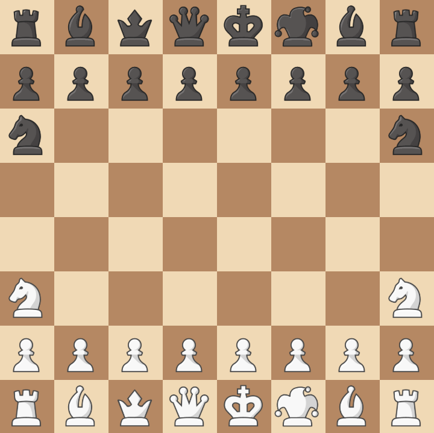

#  JESTER'S CHESS  ♔ ♕ ♖ ♤ ✧ ♗ ♘ ♙
###### *Created by: Felipe7771*
***Welcome to a variant of Xadez written entirely in the programming language `HTML/CSS/JavaScript`, 
featuring new pieces, rules (both new and removed), and various new types of checkmate moves.***

*In this version of chess, the main difference from the original game is the addition of two new pieces on the board: 
  - `the Jester ✧` (the court jester), whose unique feature is that it can make two moves in a single turn; and   - `the Prince ♤` (the heir), 
who inherits the position of the king or queen on the board.*

*As a result, 
the composition of the starting pieces is __completely different__, something worth highlighting first and foremost.*

 

## ♔ HOW TO PLAY ♕
First of all, let's review SOME rules of traditional chess before presenting the new ideas:

| Part | Name | Movement|
|:----:|:----:|-------|
| ♔ |King | 1 square in any direction|
| ♕ |Queen | Orthogonal and diagonal |
| ♖ | Tower | Orthogonal|
| ♗ | Bishop | Diagonal |
| ♘ | Knight | Jump in an L shape (2 squares to one side and 1 to the other)|

| How to win? | Attack the king without any way for him to escape the attack (Checkmate).|
|-------------|--------|
|Illegal Movements| Moving pieces that leave your king under attack will result in the move being voided.

 

| Types of Ties |
|---------------|
|With no enemy movement, the king's house is attacked BUT the king is not attacked (Drowning)|
|King vs. King|
|King vs. King and Bishop|
|King vs. King and Knight|

 

### NEW DYNAMICS ♙ ✧ ♤
-----------

**Note:** As of this current version, **__El Passant__** has been removed from the gameplay; it may or may not be added in the future...

 

### New part:   ***`The Jester ✧`*** *(The court jester)*
---------
*Jester is an eccentric piece compared to the others, always wanting to innovate in something that the others don't.* 

*Some are stiff and move orthogonally.* 

*Others are more relaxed on the diagonal.*

*With a mere joke, he wanted to be both at the same time. Like a queen? No, something more interesting: to be able to **perform 2 moves in the same turn.***
> Who's laughing now? **LOL**

 

As mentioned, unlike the other pieces, the Jester makes two moves per turn. 
Both moves allow it to move up to __`2 spaces freely.`__ 

__For the first move__, he mimics a rook: __`he attacks orthogonally`__, like a mini-rook, to impress his older brother.  
__For the second__, he mixes bishop + knight: __`he moves diagonally`__, BUT `NO CAPTURE`, and he __LOVES__ `jumping over pieces` in front of him

 __In summary:__ 
__`JESTER ✧`__*: Two moves in one turn*
|Movements|Direction|Feature|Number of active squares|
|---------|---------|-------|:---------------------:|
|1st Movement|Orthogonal|You can capture parts.|Until 2 squares|
|2nd Movement|Diagonal|__No capture.__ Can jump pieces.|ONE square|

  
_`"So... um... how does that illegal move—you know, leaving the king exposed...—work with the Jester? ...the one where it moves twice in the same turn??"`_
 — You are wondering that, right...? 

...No? 

...Oh. 

...Well, too bad. Let's take a look anyway:

 

### A simple way to put it:

_If a move that leaves your king exposed is illegal, then **a completed move** that leaves your king exposed is illegal._

 Therefore, for the Jester:

It is **`the second move that determines legality, since it completes the sequence`**.
 The first move is only provisional — it does not need to be legal on its own, as long as the final position is.

In other words:

> _A Jester may temporarily expose its king during the first move…
—but if the second move does not resolve that, the entire action is illegal._

 

| 2nd Move Result | Consequence |
|-------------------|-------------------------|
| King exposed | ❌ Illegal move |
| King safe | ✔️ Perfectly legal |
| Everyone ends up exposed | __"Son, rethink that first move."__ |
 

### New part:   ***`The Prince ♤`*** *(The successor)*
---------
*The Prince is the kingdom’s last hope,*

*a realm that has been locked in endless black-and-white wars since the 6th century. Tired of it all, despite his limited combat training, it’s time for the new dynasty to ascend the throne:*

*if the King falls, long live the new king! If the Queen falls, long live the new queen!*

 

The one who falls first will be the most interesting....

  

Regarding the above, the Prince is still a novice in combat, with only __`1 attack square on the orthogonal grid`__.  
HOWEVER, his magic lies elsewhere: He receives a promotion when a member of the royal family dies, **being the first to die**. 

- If the King is captured, `he is promoted to King`;
- if the Queen is captured, `he is promoted to Queen`.

 __In summary:__ 
__`PRINCE ♤`__*: One move orthogonal*
|Part that dies first| Promotion|
|---------|---------|
|King|Prince ⭢ ♔ King|
|Queen|Prince ⭢ ♕ Queen|

  
_`"So... Hey, here I am... again... How exactly is the checkmate... on the king... going to... work... with... um... this Prince?"`_
 — I highly doubt you didn't ask about it **—admit it!**  

 

### A simple way to put it:

_If you have a live Prince, the game (at least the system described below) __ WON'T  GIVE  A  DAMN__  if the king is in check, checkmate, or anything else..._

 _but if you don't...  or if it's already been promoted to a queen..._

  

> _**run for your life.**_

 

In other words:

| Prince ♤ | King Under Attack |
|-------------------|-------------------------|
| Alive | "Just one piece under attack—it doesn't matter" |
| Dead | __RUN AWAY__ |
| Promoted to Queen | __RUN AWAY__ |
 
